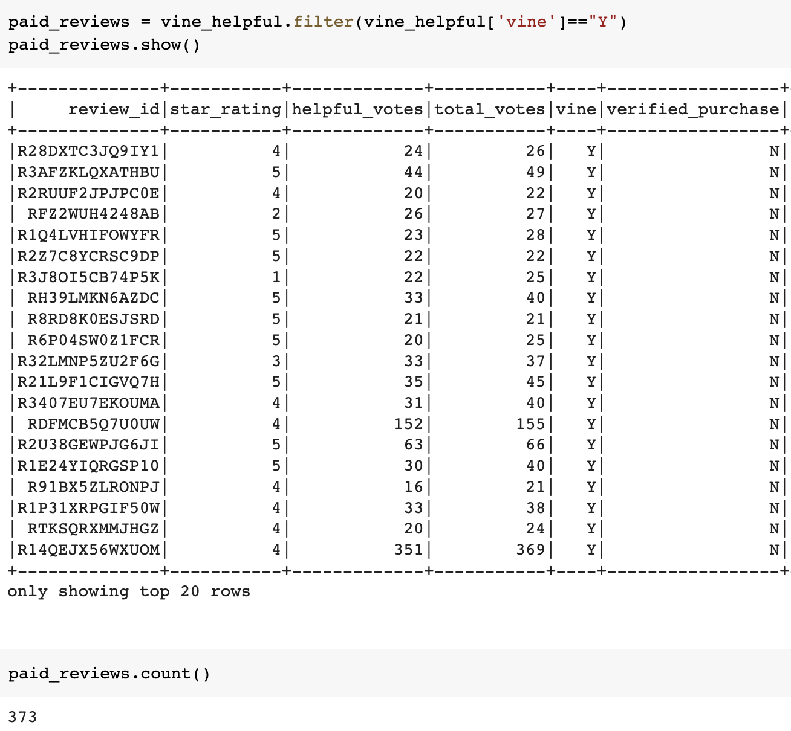

# Amazon Vine Analysis

## Overview

This analysis was performed on a set of Amazon reviews of Lawn and Garden products to determine if there is bias toward favorable reviews when those reviews come from the paid Vine members vs from a non-Vine, or unpaid, review.

## Results

After loading the Amazon review dataset and filtering to only those reviews with 20 or more total votes where at least 50% of the total votes were deemed helpful. the data was split into two dataframes - one with only paid Vine reviews and the second with only unpaid reviews.

There were 373 paid vine reviews:

And there were 45,641 unpaid reviews:

These dataframes were grouped by star rating with counts and percentages of total reviews calculated.  That analysis shows that of the 373 paid reviews, 171 or 46% were 5-star reviews and only 8 or 2% were 1-star reviews:

And it showed that 22,538 or 49% of unpaid reviews were 5-star while 9,507 or 21% were 1-star reviews:

## Summary

Based on the analysis of this dataset, it appears that there is positivity bias in the Vine program.  While the total percentage of 5-star reviews across both paid and unpaid reviews was similar (46% vs 49%) there was a much higher proportion of lower star ratings in the unpaid dataset vs the paid dataset. Plotting the star ratings as histograms would allow an easier visualization of any skew.  In addition, we could use a two-sample t-test to confirm whether there is sufficient evidence that the means of the star-ratings are statisically different between the paid and unpaid reviews.

